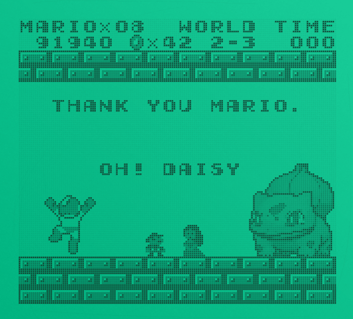

# gameboy-dot-matrix-filter-godot
A gameboy retro post-processing filter for your games. Enjoy.




# How to use

Just place any node inside the GameViewport in the game_wrapper scene (demo already has an example scene).
Make sure theres's a background to your scene with a #f8f8f8 color.

# Settings


## game_wrapper

This scene has the wrapper with the ViewportContainer that holds the gameboy dot-matrix shader.

The Control and ViewportContainer have the same resolution. 

In the example, to simulate the gameboy screen, the GameViewport is 5 times smaller than the ViewportContainer (160x144, which is the gb resolution). This factor (5) is used as the stretch shrink parameter in the ViewportContainer. 5 is also the size of each dot in the matrix (set in the shader parameter).

## COLORS

All the sprites in the scene will be colored by shade(s) of gray. These shades will be mixed with the pallete2 color chosen.
Make sure theres's a background to your scene with a #f8f8f8 color.
You can use all 255 shades of gray available, but to be faithfull to the original gameboy, which only had 4 different shades, you can use the following values of rgb to mimic the original system limitation.

```
#000000 - BLACK
#606060 - DARK GRAY
#a8a8a8 - LIGHT GRAY
#f8f8f8 - BACKGROUND
```

## TO DO
- Matrix shadows
