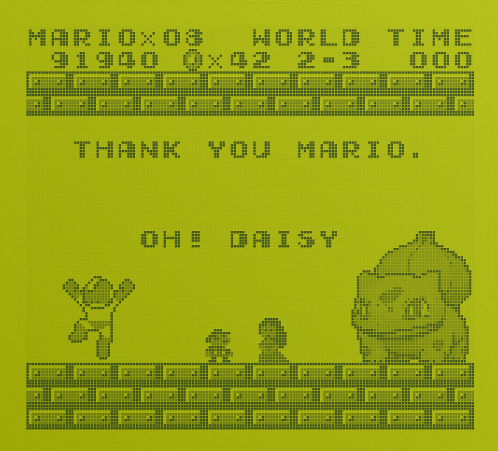
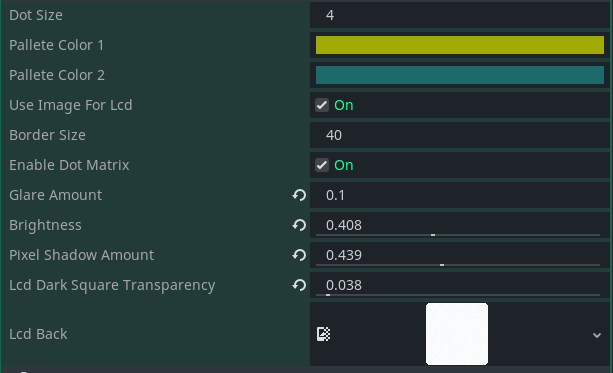

# gameboy-dot-matrix-filter-godot

A gameboy retro post-processing filter for your games. Enjoy.
Feel free to make pull requests.

### 2D




### 3D


# How to use

Just place any node inside the GameViewport in the game_wrapper scene (demo already has an example scene).
Make sure theres's a background to your scene with a #f8f8f8 color.

If you want to make the dots bigger, change the value of the stretch shrink in the ViewportContainer. This value is also the dot size in the shader parameter.

# Settings



## game_wrapper

- This scene has the wrapper with the ShaderViewportContainer that holds the gameboy dot-matrix shader.
- The Control and WrapperViewportContainer have the resolution of the screen + borders.
- The GameViewportContainer is sized and offset to match the borders.

## COLORS

All the sprites in the scene will be colored by shade(s) of gray. These shades will be mixed with the pallete2 color chosen.
Make sure theres's a background to your scene with a #f8f8f8 color.
You can use all 255 shades of gray available, but to be faithfull to the original gameboy, which only had 4 different shades, you can use the following values of rgb to mimic the original system limitation.

```
#000000 - BLACK
#606060 - DARK GRAY
#a8a8a8 - LIGHT GRAY
#f8f8f8 - BACKGROUND
```

## TO DO

- Better pixel shadows
- Better color reproduction
- LCD latency
